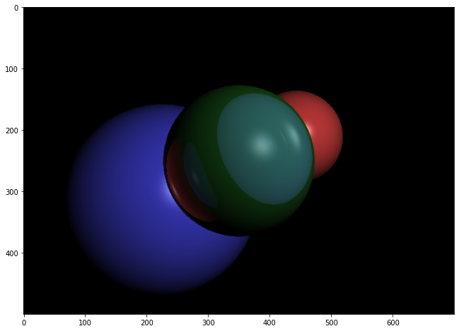

# Ray tracing

Implementation of the Ray Tracing algorithm written in Python.

- Source code and generated images are in the [ray-tracing.ipynb](./ray-tracing.ipynb) file.



## Venv in Jupyter Notebook 

### Add your virtual environment to Jupyter:

```sh
python -m ipykernel install --user --name=myenv
```

### Remove Virtual Environment from Jupyter Notebook

#### List available kernels:

```sh
jupyter kernelspec list
```

#### Uninstall the kernel:

```sh
jupyter kernelspec uninstall myenv
```
